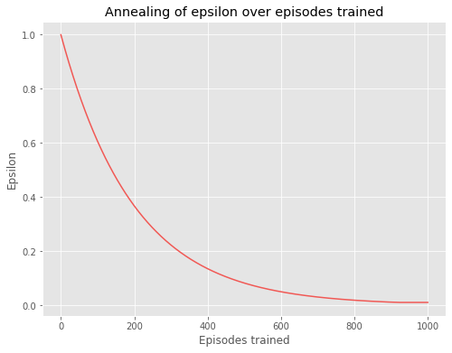
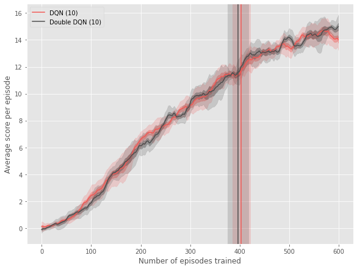

# Report

## Learning Algorithm
We use a Q-Learning algorithm for off-policy TD control using neural networks for
function approximation. We train two types of agents:
* **Deep Q-network agent (DQN)**: which approximates a state-value function in a Q-Learning
framework with a neural network. **Mnih et al. (2015)**
* **A Double Q-learning agent (DDQN)**: that utilises double estimation to counteract
overestimation problems with traditional Q-learning. **van Hasselt et al. (2015)**

### Model architecture
The exact architecture used for the neural network is as follows. The input to the neural
network has 37 dimensions and contains the agent's velocity, along with ray-based
perception of objects around the agent's forward direction. The first hidden layer
is fully-connected and consists of 64 rectifier units. The second hidden layer is
also fully-connected and consists of 64 rectifier units. The output layer is a
fully-connected linear layer with a single output for each of the four valid actions.

### Training details
The behaviour policy during training was ε-greedy with ε decayed from 1.0 to 0.01 at
a decay rate of 0.995, and fixed at 0.01 thereafter. The plot below demonstrates
how epsilon decays over the episodes. We trained each agent for a total of 600 episodes
and used a replay memory of 100K most recent experiences.

In these experiments, we used the Adam algorithm with mini-batches of size 64. The table
The values and description of all the hyper-parameters are provided in the table below.

**Table:** List of hyper-parameters and their values

Hyperparameter | Value | Description
------------ | ------------- | -------------
minibatch size | 64 | Number of training cases over which each SGD update is computed
replay memory size | 100K | Data for SGD update is sampled from this number of most recent experiences
discount factor | 0.99 | Discount factor used in the Q learning update
update frequency | 4 | the number of time steps between successive SGD updates
learning rate | 5e-4 | Learning rate parameter used by Adam
initial exploration | 1.0 | Initial value of epsilon
final exploration | 0.01 | Final value of epsilon
epsilon decay rate | 0.995 | rate at which epsilon is decayed between every episode
replay start size | 64 | A uniform random policy is run for this many time steps before learning starts and the resulting experience is used to populate the replay memory
tau | 1e-3 | parameter to soft update target network parameters `θ_target = τ*θ_local + (1 - τ)*θ_target`

The same set of hyper-parameters were used for both DQN and DDQN networks. The values of all the hyper-parameters
were picked based on an informal assessment of performance and is likely not the optimal set of parameters.

### Evaluation procedure
The key evaluation metric that is tracked is the average reward collected by the agent over 100 episodes.
The environment is considered solved when the agent gets an average score of +13 over 100 consecutive episodes.
We train each agent for 600 episodes and track how this metric evolves temporally. We expect this metric to keep
increasing with more training episodes. Further, the algorithm that gets to the score of +13 in fewer number of
training episodes can be considered superior.

In order to establish the generalizability of the results, for each algorithm, we train 10 agents with
different random seeds. The final result we study is an average of the evaluation metric over all these runs.
We also track the standard deviation and error in estimate of mean. See the Results section for more details.

### Results
The plot below shows the training curves tracking the agent’s average score. We use a slightly modified version of
the [plotting approach](https://github.com/openai/baselines/blob/master/docs/viz/viz.ipynb) from the `baselines`
library to succinctly show results of the multiple agent training runs.

Each agent is shown in a distinct color. Each point is the average (smoothed) score achieved per episode after the
agent is run. The smoothing is performed over a 10 episode smoothing window. The lighter shade around the scores
line shows the standard deviation of data, and darker shade - error in estimate of the mean (i.e. standard deviation
divided by square root of number of seeds). The solid vertical line shows the average (over multiple training runs)
episodes the environment was solved in. The shaded area around the line shows the standard deviation of this data.

We make the following observations from the plot:
* The training of both the DQN agent and the DDQN agent is stable as illustrated by the increasing average
score over the training timeline
* Both agents are able to solve the environment in under 600 episodes - typically in range of ~375-425 episodes.
* On average, the DDQN seems to perform marginally better than DQN as evidenced by the fewer average number of
episodes it takes for Double-DQN to solve the environment - 396 for DDQN vs 403 for DQN. However, there is no clear
winner between the two given the overlap between the standard deviation bands.

## Ideas for future work
* We did not perform a systematic hyper-parameter tuning exercise to arrive at an optimal set of hyper-parameter. While
the computational cost may be high for a comprehensive parameter sweep, it is very likely that we can train better
agents when using more tuned parameters.

* We have shown that the Banana collector environment can be solved by methods such as DQN and DDQN. These are
only two among the several advancements the deep RL community has made. The DeepMind paper
[Hessel et al.(2018) Rainbow: Combining Improvements in Deep Reinforcement Learning](https://arxiv.org/pdf/1710.02298.pdf)
provides a comprehensive look at comparing the different algorithms and how they complement each other. A similar
approach would help us train even better agents. Things to consider include Prioritized Experience replay and
Dueling DDQN.

## Code availability.
The source code can be accessed at https://github.com/nsriram13/rl-navigation.

## References
* Hasselt, Hado van, Arthur Guez, and David Silver. “Deep Reinforcement Learning with Double Q-Learning.”
ArXiv:1509.06461 [Cs], December 8, 2015. http://arxiv.org/abs/1509.06461.
* Mnih, Volodymyr, Koray Kavukcuoglu, David Silver, Andrei A. Rusu, Joel Veness, Marc G. Bellemare,
Alex Graves, et al. “Human-Level Control through Deep Reinforcement Learning.” Nature 518, no. 7540
(February 2015): 529–33. https://doi.org/10.1038/nature14236.
* Hessel, Matteo, Joseph Modayil, Hado van Hasselt, Tom Schaul, Georg Ostrovski, Will Dabney, Dan Horgan,
Bilal Piot, Mohammad Azar, and David Silver. “Rainbow: Combining Improvements in Deep Reinforcement Learning.”
ArXiv:1710.02298 [Cs], October 6, 2017. http://arxiv.org/abs/1710.02298.
